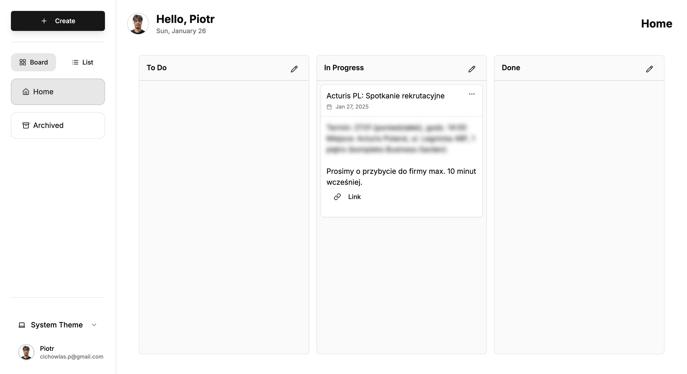
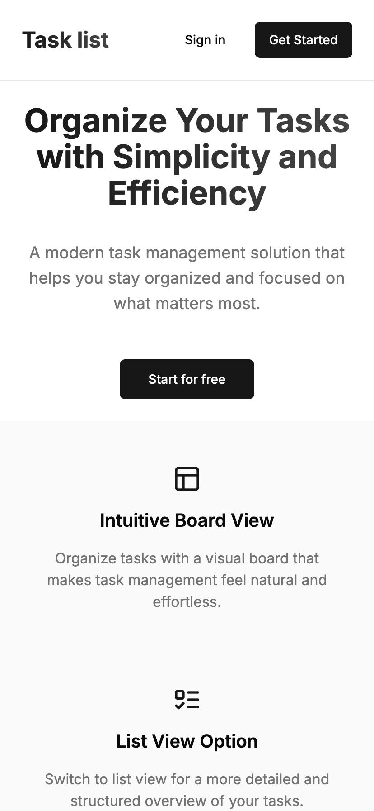
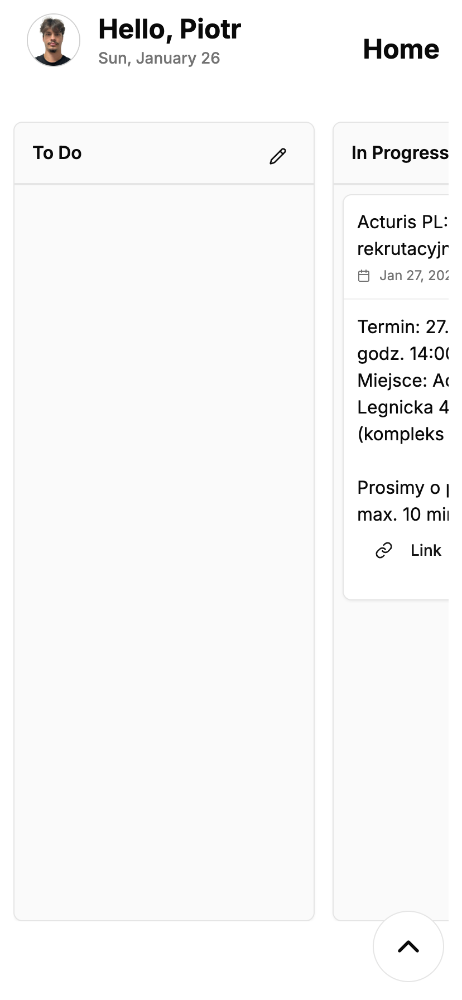
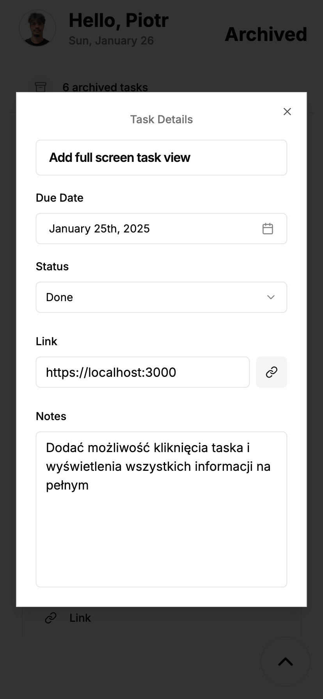
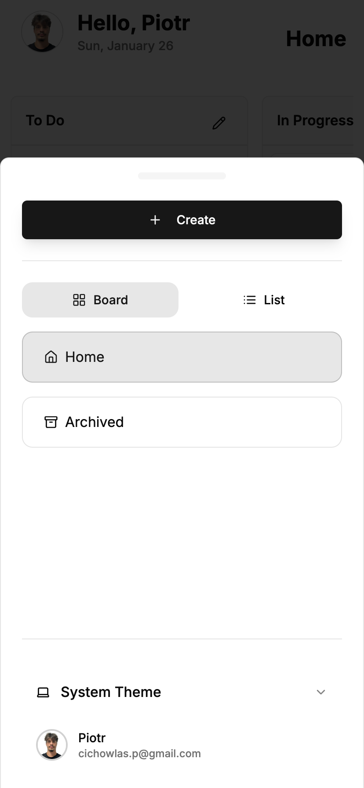
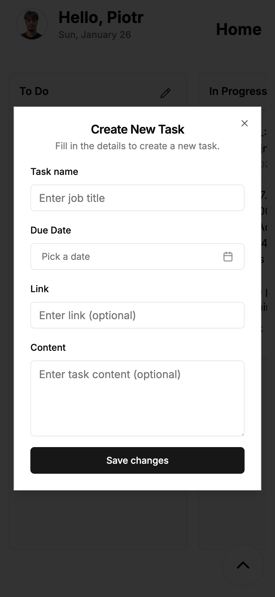

# Task List - Modern Task Management Solution

A powerful, Asana-inspired task management application built with Next.js and Supabase. Organize your tasks with an intuitive board view and stay productive.



## ✨ Features

-   📋 Intuitive Board View
-   📱 Fully Responsive Design
-   🔄 Real-time Updates
-   👥 User Authentication
-   🎯 Task Management
-   📊 Custom Board Layout
-   🌙 Dark Mode Support

## 🚀 Live Demo

Experience Task List in action: [https://job-status.vercel.app/](https://job-status.vercel.app/)


## 🛠️ Tech Stack

-   [Next.js 14](https://nextjs.org/) - React Framework
-   [Supabase](https://supabase.com/) - Backend & Authentication
-   [Shadcn/ui](https://ui.shadcn.com/) - UI Components
-   [Tailwind CSS](https://tailwindcss.com/) - Styling
-   [TypeScript](https://www.typescriptlang.org/) - Type Safety

## 📱 Mobile Support

Task List is fully optimized for mobile devices, providing a seamless experience across all screen sizes:

-   Responsive layout adaptation
-   Touch-friendly interface
-   Mobile-optimized task management
-   Bottom drawer navigation
-   Gesture support for task interactions

### Mobile Screenshots

<div align="center">
  
  
  
</div>

### Mobile Experience

<div align="center">
  
  
</div>

## 💻 Getting Started

### Prerequisites

-   Node.js (v18 or higher)
-   Supabase account

### Installation

1. Clone the repository

```bash
git clone https://github.com/yourusername/task-list.git
cd task-list
npm run dev
```
